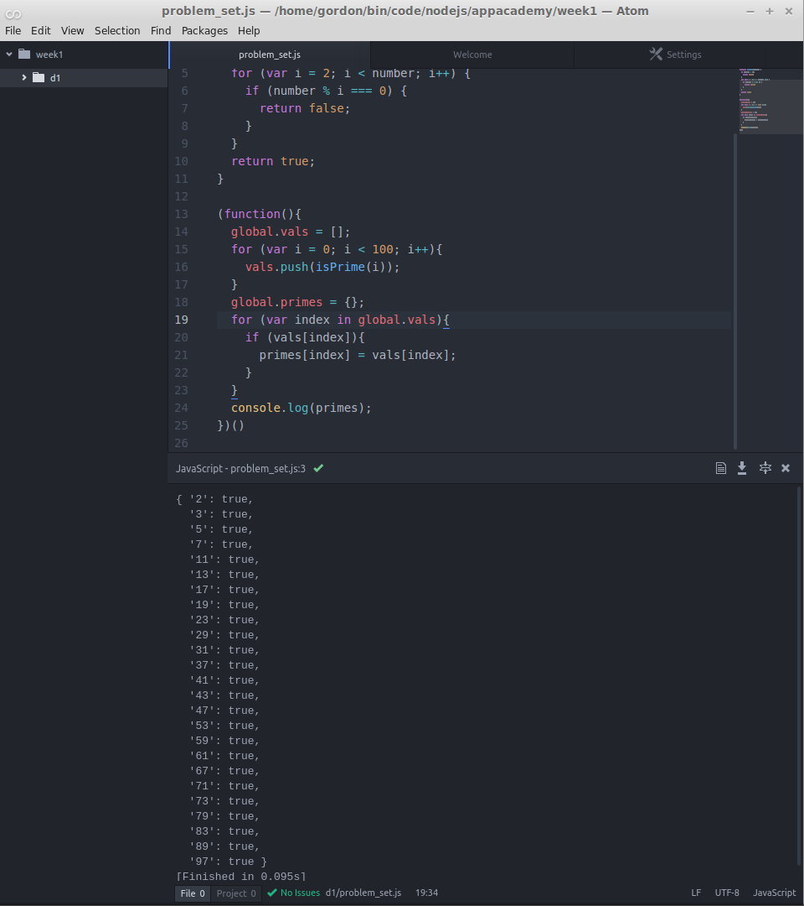
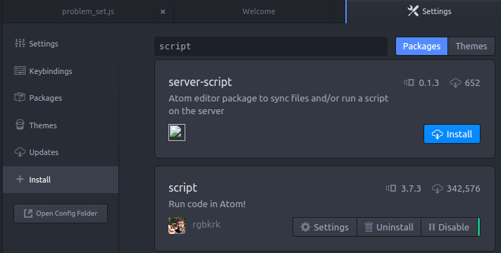
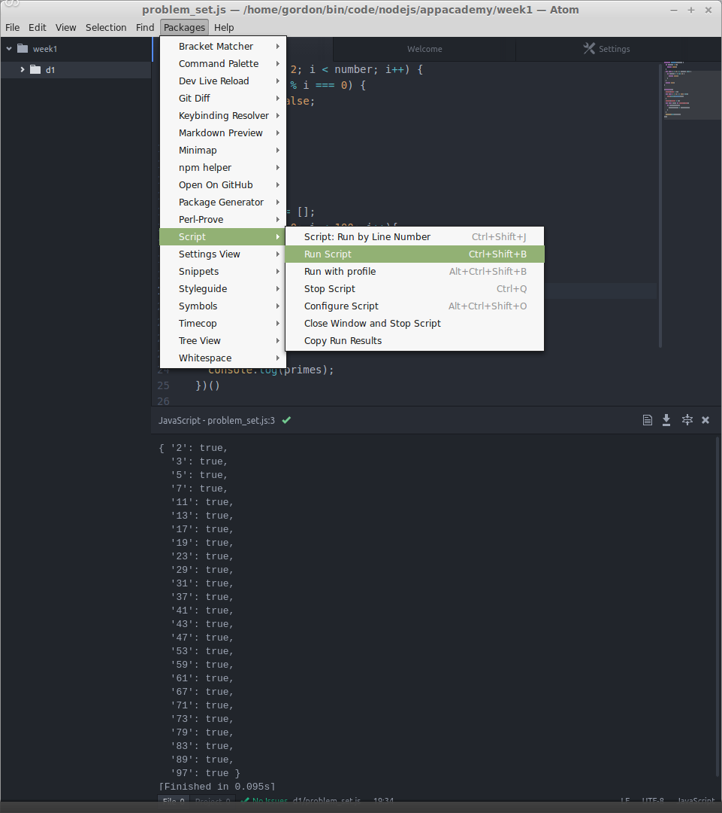

# Atom Plugin Which Runs Javascript from Inside Atom - No More "$node myfile.js"!!!

### Why is this important?
It's important to know how to use the command line and how to run your Javascript files with Node. Once one can do that, it's nice to centralize one's workflow around a single tool. There's a package for Atom called 'Script' which can run files with the press of a hotkey combination, and then display the output from within Atom.

This picture shows the plugin 'Script' in action (look at the bottom half of the picture, where Script's output is shown:

